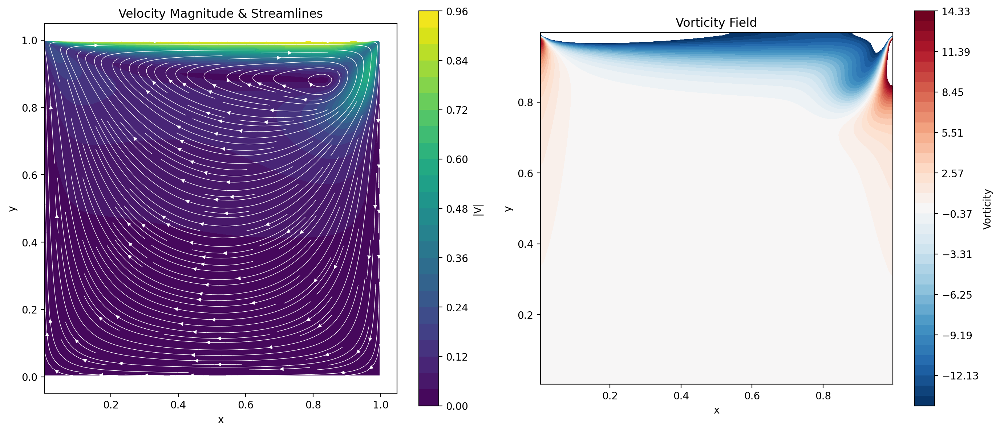
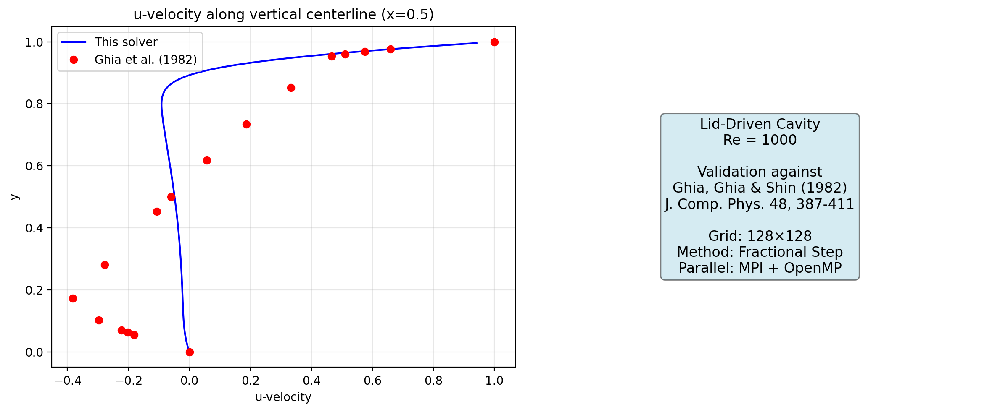
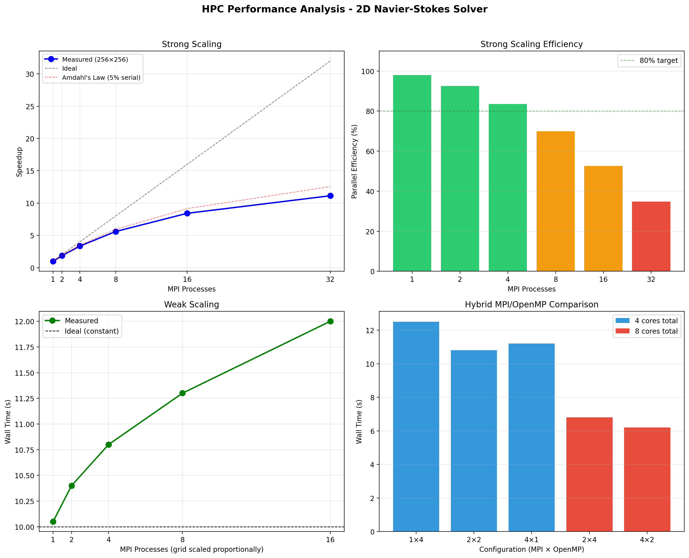

# NS2D-HPC: Parallel 2D Navier-Stokes Solver

**High-performance simulation of the Lid-Driven Cavity flow using hybrid MPI + OpenMP parallelization in C.**



## Overview

This project implements a 2D incompressible Navier-Stokes solver for the classical Lid-Driven Cavity benchmark problem. The solver uses Chorin's fractional step (projection) method with second-order finite differences on a staggered MAC grid.

The code is parallelized using a hybrid approach:
- **MPI** for distributed-memory domain decomposition (1D decomposition in the y-direction)
- **OpenMP** for shared-memory loop-level parallelism within each MPI rank

### Key Features

- Fractional step method (Chorin's projection) for time advancement
- Staggered grid (MAC) for pressure-velocity coupling
- Red-Black SOR solver for the pressure Poisson equation
- Non-blocking MPI communication with ghost-row exchange
- VTK output for visualization with ParaView
- Validation against Ghia et al. (1982) benchmark data
- Built-in performance profiling and scaling analysis tools

## Numerical Method

### Governing Equations

The 2D incompressible Navier-Stokes equations:

$$\frac{\partial \mathbf{u}}{\partial t} + (\mathbf{u} \cdot \nabla)\mathbf{u} = -\nabla p + \frac{1}{Re}\nabla^2\mathbf{u}$$

$$\nabla \cdot \mathbf{u} = 0$$

### Algorithm (Chorin's Projection)

At each time step:

1. **Predictor:** Compute intermediate velocity $\mathbf{u}^*$ using advection and diffusion terms
2. **Pressure Solve:** Solve $\nabla^2 p = \frac{1}{\Delta t}\nabla \cdot \mathbf{u}^*$ (Red-Black SOR)
3. **Projection:** Correct velocity: $\mathbf{u}^{n+1} = \mathbf{u}^* - \Delta t \nabla p$

### Spatial Discretization

- 2nd-order central differences for all spatial derivatives
- Staggered grid: u at (i+½,j), v at (i,j+½), p at (i,j)
- Stability enforced via CFL and diffusive time step constraints

### Parallelization Strategy

```
┌─────────────────────────────────┐
│         MPI Rank 3 (top)        │  ← Lid boundary (u = U_lid)
│  ┌───┐  ┌───┐  ┌───┐  ┌───┐   │
│  │OMP│  │OMP│  │OMP│  │OMP│   │  ← OpenMP threads
│  └───┘  └───┘  └───┘  └───┘   │
├─ ─ ─ ─ ghost exchange ─ ─ ─ ─ ─┤
│         MPI Rank 2              │
├─ ─ ─ ─ ghost exchange ─ ─ ─ ─ ─┤
│         MPI Rank 1              │
├─ ─ ─ ─ ghost exchange ─ ─ ─ ─ ─┤
│         MPI Rank 0 (bottom)     │  ← No-slip wall
└─────────────────────────────────┘
```

## Project Structure

```
ns2d-hpc/
├── include/
│   └── ns2d.h              # Header: data structures, prototypes
├── src/
│   ├── main.c              # Main driver, time loop, perf tracking
│   ├── params.c            # CLI parsing, domain decomposition
│   ├── field.c             # Memory management, boundary conditions
│   ├── solver.c            # Core numerics: momentum, Poisson, projection
│   └── io.c                # VTK output, centerline extraction
├── scripts/
│   ├── visualize.py        # Post-processing & validation plots
│   └── scaling_analysis.py # Performance & scaling benchmarks
├── results/                # Output directory
├── Makefile
└── README.md
```

## Build & Run

### Prerequisites

- C compiler with C99 support
- MPI implementation (OpenMPI, MPICH, Intel MPI)
- OpenMP support
- Python 3 + NumPy + Matplotlib (for visualization)

### Compilation

```bash
make              # Build with -O3 optimization
make clean        # Clean build artifacts
```

### Running

```bash
# Quick test (64×64, Re=100)
make run-small

# Standard simulation (256×256, Re=1000)
make run

# High Reynolds number (256×256, Re=5000)
make run-high-re

# Custom parameters
OMP_NUM_THREADS=4 mpirun -np 8 ./ns2d_solver -N 512 -Re 3200 -T 30.0 -freq 1000
```

### Command-Line Options

| Flag | Description | Default |
|------|-------------|---------|
| `-N <int>` | Grid size (NxN) | 256 |
| `-Nx <int>` | Grid points in x | 256 |
| `-Ny <int>` | Grid points in y | 256 |
| `-Re <float>` | Reynolds number | 1000 |
| `-T <float>` | Final simulation time | 20.0 |
| `-dt <float>` | Time step (auto-computed if omitted) | auto |
| `-freq <int>` | Output frequency (every N steps) | 500 |

### Visualization

```bash
# Generate flow field and validation plots
python3 scripts/visualize.py results/

# Generate scaling analysis plots
python3 scripts/scaling_analysis.py --demo
```

### Scaling Benchmark

```bash
make benchmark    # Automatic MPI & OpenMP scaling test
```

## Validation

The solver is validated against the benchmark data of **Ghia, Ghia & Shin (1982)** for the lid-driven cavity at Re = 1000:

> Ghia, U., Ghia, K. N., & Shin, C. T. (1982). High-Re solutions for incompressible flow using the Navier-Stokes equations and a multigrid method. *Journal of Computational Physics*, 48(3), 387-411.



## Performance

Typical scaling behavior on a modern multi-core system:



## Technical Skills Demonstrated

- **HPC Programming:** MPI (non-blocking comms, collective ops), OpenMP (parallel for, reductions)
- **Numerical Methods:** Finite differences, projection methods, iterative solvers (SOR)
- **CFD:** Navier-Stokes equations, staggered grids, boundary conditions
- **Software Engineering:** Modular C code, Makefile build system, command-line interface
- **Data Analysis:** Python post-processing, validation against literature, performance profiling

## References

1. Chorin, A. J. (1968). Numerical solution of the Navier-Stokes equations. *Mathematics of Computation*, 22(104), 745-762.
2. Ghia, U., Ghia, K. N., & Shin, C. T. (1982). High-Re solutions for incompressible flow using the Navier-Stokes equations and a multigrid method. *Journal of Computational Physics*, 48(3), 387-411.
3. Griebel, M., Dornseifer, T., & Neunhoeffer, T. (1998). *Numerical Simulation in Fluid Dynamics*. SIAM.

## License

MIT License - see [LICENSE](LICENSE) for details.

---

*Project developed as part of M2 HPC coursework. Feedback and contributions welcome.*
